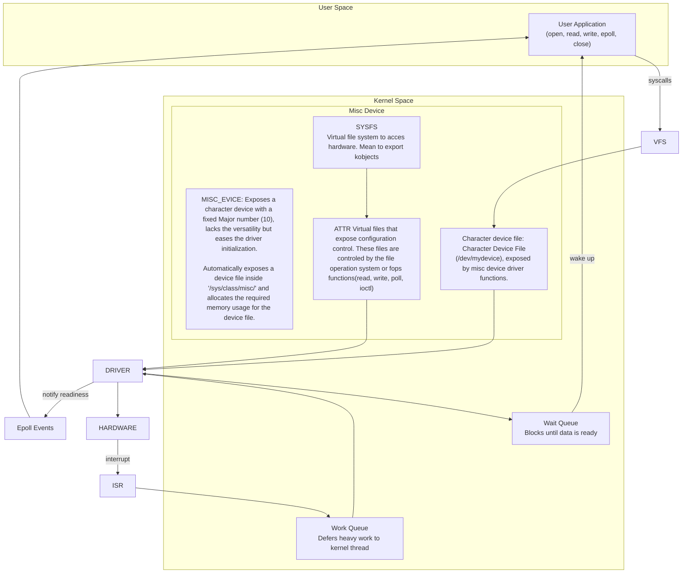

```mermaid
flowchart TB
    %% ===========
    %% USER SPACE
    %% ===========
    subgraph USER_SPACE["User Space"]
        APP["User Application\n(open, read, write, epoll, close)"]
    end

    %% ===========
    %% KERNEL SPACE
    %% ===========
    subgraph KERNEL_SPACE["Kernel Space"]
        subgraph MISC_DEVICE_DRIVER["Misc Device"]
            MISC_DEVICE["MISC_EVICE: Exposes a character device with a fixed Major number (10), lacks the versatility but eases the driver initialization.
                         Automatically exposes a device file inside '/sys/class/misc/' and allocates the required memory usage for the device file."]
            CHAR_FILE["Character device file: Character Device File\n(/dev/mydevice), exposed by misc device driver functions."]
            SYSFS["SYSFS\nVirtual file system to acces hardware. Mean to export kobjects"]
            ATTR["ATTR Virtual files that expose configuration control. These files are controled by the file operation system or fops functions(read, write, poll, ioctl)"]
        end
        WAITQ["Wait Queue\nBlocks until data is ready"]
        WORKQ["Work Queue\nDefers heavy work to kernel thread"]
    end

    %% ===========
    %% CONNECTIONS
    %% ===========

    %% Control Path
    SYSFS --> ATTR --> DRIVER

    %% Data Path
    APP -->|"syscalls"| VFS --> CHAR_FILE --> DRIVER
    DRIVER --> HARDWARE
    HARDWARE -->|"interrupt"| ISR --> WORKQ
    WORKQ --> DRIVER
    DRIVER --> WAITQ
    WAITQ -->|"wake up"| APP

    %% Epoll notification path
    DRIVER -->|"notify readiness"| EPOLL["Epoll Events"]
    EPOLL --> APP

```
# Interactions

