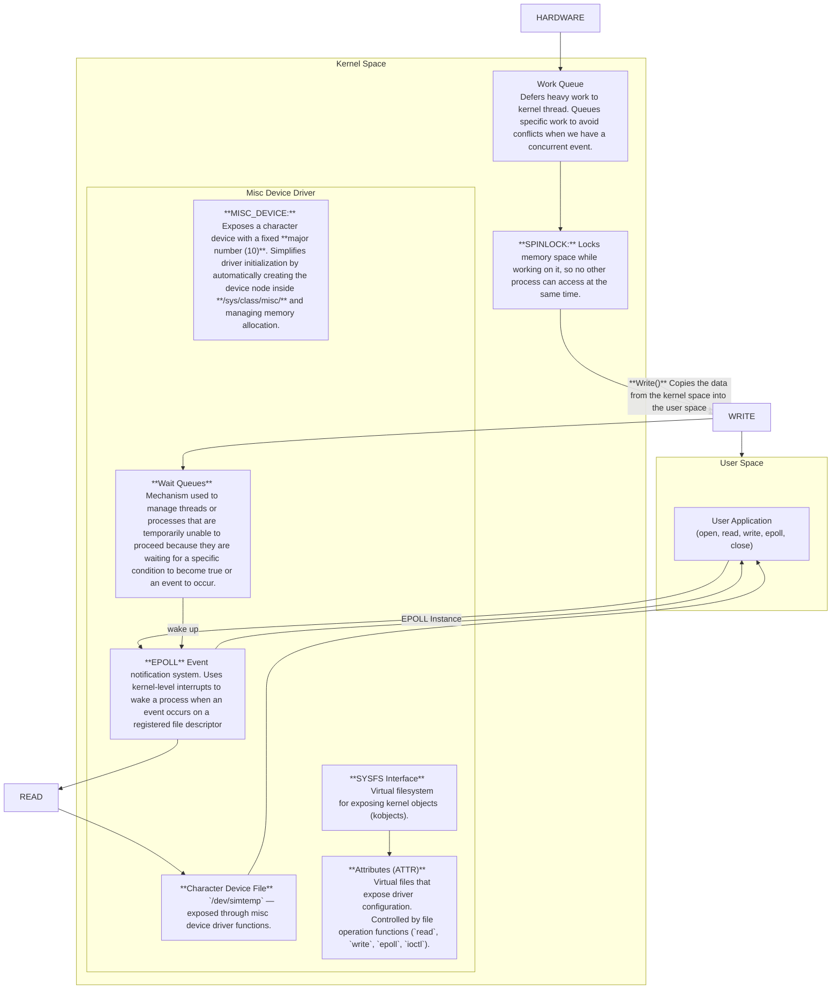

# Interactions

## User Space (APP)

- The application opens /dev/simtemp and registers the file descriptor using epoll.
- When data is available or the threshold event triggers, the kernel wakes the wait queue, which signals the epoll instance.
- The app then performs a non-blocking read() to fetch temperature data and updates the GUI (plot and buffer).

## Kernel Space (Driver)
- The driver is implemented as a miscellaneous device, simplifying initialization (fixed major number and automatic /dev/simtemp node creation).
- A high-resolution timer (hrtimer) periodically enqueues temperature sampling work into a workqueue.
- The workqueue handler generates a new temperature sample, writes it into a circular buffer, and signals the wait queue if a new event or threshold condition is met.
- The poll/epoll system call in user space is awakened through wake_up_interruptible(), triggering a notification event.

## Configuration Interface (SYSFS / ATTR)
- Driver parameters such as mode, threshold, and sampling period are exposed via /sys/class/misc/simtemp/.
- These virtual files are tied to device_attribute handlers that implement show() and store() functions for reading and writing configuration values.
- This allows user-space tools to change runtime parameters without recompiling or reloading the module.

##🔒 Locking Choices
- Spinlocks are used in the workqueue handler and circular buffer to protect data updates that may occur in interrupt or softirq context.
spin_lock_irqsave(&lock, flags);
/* update buffer, state */
spin_unlock_irqrestore(&lock, flags);

They’re chosen because:
Execution time inside the critical section is very short.
The context cannot sleep (e.g., timer callback).
Mutexes are not used here, since the operations that modify temperature samples occur inside the workqueue or interrupt context, where sleeping is not allowed.

## ⚙️ API Design Choices
Interface	Purpose	Why Used
sysfs attributes    |    Configure parameters (mode, sampling_ms, threshold_mC)	Human-readable interface for runtime tuning. Persistent via /sys/class/misc/simtemp/.
read()    |	Transfer temperature data to user space	Simple, synchronous mechanism. Works naturally with poll/epoll.
poll() / epoll()    |	Notify user-space on new data or threshold alert	Efficient event-driven mechanism; no busy-waiting.

## 🌳 Device Tree Mapping

The Device Tree Overlay (simtemp.dtbo) registers a node compatible with "nxp,simtemp".

When the kernel loads the overlay, the probe() function of the driver is called automatically for this compatible string.

Defaults:
If no device tree entry is provided, the driver falls back to built-in defaults (e.g., mode = NORMAL, sampling = 1000 ms, threshold = 30000 m°C).

